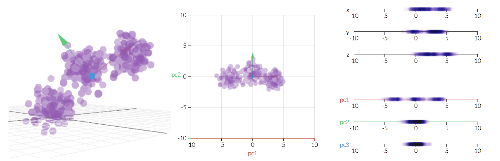

```{r setup, include=FALSE}
knitr::opts_chunk$set(echo = TRUE, rows.print = 10)
```

# Lesson Objectives

* Gain an intuitive understanding of principal component analysis (PCA)
* Apply PCA to understand the structure in multi-dimensional datasets such as RNAseq

```{r, echo = FALSE, message = FALSE}
# In the repository data is read from the current directory
# Load the tidyverse package
library(tidyverse)

# Load the data
load("data/fission_data.RData")
```


# PCA basics

Having expression data for thousands of genes can be overwhelming to explore! 
This is a good example of a multi-dimensional dataset: we have many 
variables (genes) that we want to use to understand patterns of similarity 
between our samples (yeast cells).

There are several methods to help summarise multi-dimensional data, here 
we will show how to use PCA (principal component analysis). 

PCA is a transformation of high-dimensional data into an orthogonal basis such that 
first principal component (PC, aka "axis"") is aligned with the largest source of 
variance, the second PC to the largest remaining source of variance and so on. 
This makes high-dimensional data more amenable to visual exploration, as we can 
examine projections to the first two (or few) PCs.

 
[Link to the original animation](http://setosa.io/ev/principal-component-analysis/)

There are three basic types of information we obtain from a PCA:

* PC scores - these are the coordinates of our samples on the new PC axis
* Eigen values - these represent the variance explained by each PC. 
We can use these to calculate the proportion of variance in the original data 
that each axis explains.
* Eigen vectors - these reflect the "weight" that each variable has on a particular 
PC. These can be thought of as the correlation between the PC and the original variable.


# Running PCA using `prcomp()`

To compute a PCA in R we can use the `prcomp()` function. This function takes a 
matrix of data, where the _columns_ are the _variables_ that we want to use to 
transform our _samples_, which should be the _rows_ of the matrix. 

In our case, we want to look for similarities across our yeast cells (_samples_ = _rows_) 
based on gene expression (_variables_ = _columns_). For that reason, we need 
to provide a _transposed_ version of our table to the `prcomp()` function:

```{r}
sample_pca <- prcomp(t(trans_cts))
```

We can quickly visualise how our samples look like projected onto the new principal 
component space using the `autoplot()` function from the `ggfortify` package:

```{r}
library(ggfortify)
autoplot(sample_pca)
```

This is a very simple plot, but already we can see there is some structure in our 
data, suggesting clusters of samples that are more similar to each other.

There's also information about how much variation each principal component axis 
explains. 

We can annotate this plot further by providing the `autoplot()` function with 
our sample information data (see `?autoplot.prcomp` for more information):

```{r}
autoplot(sample_pca, data = sample_info, colour = "minute", shape = "strain")
```

From this plot, we can see that:
* samples seem to cluster by time-point, suggesting most of the variance in 
transcriptome is due to stress exposure. 
* T120 and T180 seem to be undistinguishable using PC1 and PC2 (but they might 
be distinguishable if we explore other PC axis!). 
* the genotype does not drive major changes in the transcriptome (but, again, 
it doesn't mean that no genes differ between the genotypes, just that they don't 
explain most of the variance captured by PC1 and PC2)


# Exploring PCA output

The above visualisation can be enough for what we are trying to answer, but we 
can go deeper into understanding our PCA. Namely:

* How many PCs do we have and how much variance do they explain?
* Which genes have the most influence on each PC axis? 

To answer these questions we need to access information about _eigenvalues_ and 
_eigenvectors_ of our PCA. 

### Variance explained by PCs

We need to extract the variance explained by each PC from our `sample_pca` object.
We could do this "manually", using `sample_pca$sdev`, but instead we will use a 
function from the [`broom` package](https://cran.r-project.org/web/packages/broom/vignettes/broom.html)
which conveniently formats the data for plotting:

```{r}
library(broom)

# PC variances (eigen values)
tidy(sample_pca, matrix = "pcs")
```

This table can be easily used to produce a _Scree Plot_, which shows the fraction 
of total variance explained by each principal component. We will show both the 
variance explained by individual PCs as well as the cumulative variance, using a 
type of visualisation known as a [pareto chart](https://en.wikipedia.org/wiki/Pareto_chart):

```{r}
tidy(sample_pca, matrix = "pcs") %>% 
  ggplot(aes(x = factor(PC))) +
  geom_col(aes(y = percent)) +
  geom_line(aes(y = cumulative, group = 1)) + geom_point(aes(y = cumulative)) +
  labs(x = "Principal component", y = "Fraction variance explained")
```

You can see how successive PCs explain less and less of the total variance in the 
original data. Also note that `r length(sample_pca$sdev)` components are enough to 
virtually explain _all_ of the variance in our dataset. 
That's a huge dimensionality reduction from `r nrow(trans_cts)` variables (genes) 
down to just `r length(sample_pca$sdev)`!


### Exploring correlation between genes and PCs

Let's say we want to know which genes have the highest influence along PC1 and PC2 that 
we plotted above. Usually, this type of question is answered by using a [biplot](https://en.wikipedia.org/wiki/Biplot).

You can easily produce such a plot using the `autoplot()` function:

```{r, eval=FALSE}
# Example using iris dataset
autoplot(prcomp(iris[, -5]), data = iris, colour = "Species",
         loadings = TRUE, loadings.label = TRUE)
```

However, because we have thousands of genes, this would be completely incomprehensible 
(and probably crash your computer!).

Instead, for big data like this, we will have to be more selective and focus on a few 
genes only. 

First, let's extract the eigenvectors of each PC from our `sample_pca` object. 

We can do this "manually" with the following command, which returns a 
matrix (and we convert it to a `tibble`):

```{r}
sample_pca$rotation %>% 
  as_tibble(rownames = "gene")
```

Or we can again use the `broom` package, which instead returns a table in a "long" 
format:

```{r}
tidy(sample_pca, matrix = "variables")  # variable loadings (eigen vectors) for genes that were used as variables in PCA
```

From these data, we can extract the genes with the highest eigenvalues along PC1 
and PC2. Let's use the "long" formated data for this:

```{r}
top_genes <- tidy(sample_pca, matrix = "variables") %>%  
  # retain only PC1 and PC2
  filter(PC %in% 1:2) %>%
  # for each PC
  group_by(PC) %>%
  # sort table by descending value
  arrange(desc(abs(value))) %>%
  # take top 10 rows of each PC group
  slice(1:5) %>%
  # extract the column (gene name) from the table
  pull(column) %>%
  # retain unique gene names only
  unique()

top_genes
```

Now, let's use this list of gene names to subset the eigenvalues table:

```{r}
gene_loadings <- sample_pca$rotation %>% 
  as_tibble(rownames = "gene") %>% 
  filter(gene %in% top_genes)
```

We can use this to draw vectors of each gene's loading projected onto each PC:

```{r}
ggplot(gene_loadings) +
  geom_segment(aes(x = 0, y = 0, xend = PC1, yend = PC2), 
               arrow = arrow(length = unit(0.1, "in")),
               colour = "brown") +
  geom_text(data = gene_loadings, 
            aes(x = PC1, y = PC2, label = gene),
            nudge_y = 0.005, size = 3) +
  scale_x_continuous(expand = c(0.02, 0.02))
```

Alternatively, we add this to our PCA visualisation from before:

```{r}
autoplot(sample_pca, data = sample_info, colour = "minute", shape = "strain") +
  geom_segment(data = gene_loadings, 
               aes(x = 0, y = 0, xend = PC1, yend = PC2), 
               arrow = arrow(length = unit(0.1, "in")),
               colour = "brown") +
  ggrepel::geom_text_repel(data = gene_loadings, 
            aes(x = PC1, y = PC2, label = gene),
            nudge_y = 0.005, size = 3) +
  scale_x_continuous(expand = c(0.02, 0.02))
```

This is still a bit crowded, but you can play around with these commands to 
improve the visualisation (e.g. restrict the number of genes even more)
